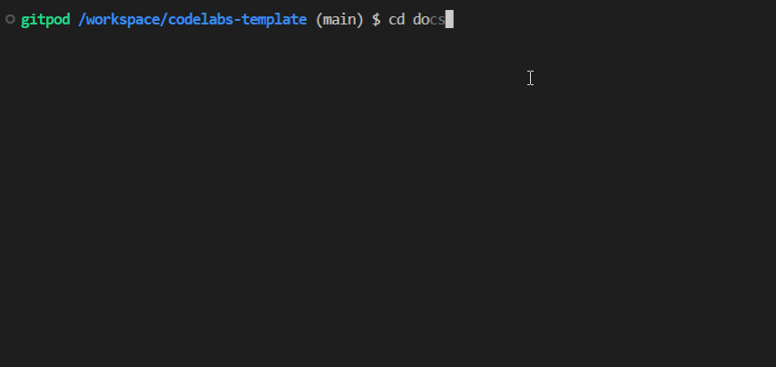

# codelabs-template

1. install claat tool

```bash
go install github.com/googlecodelabs/tools/claat@latest
```

2. Generate labs with `claat` tool


     
     
3. Add add changes to this repository, they will be automatically served via github pages
